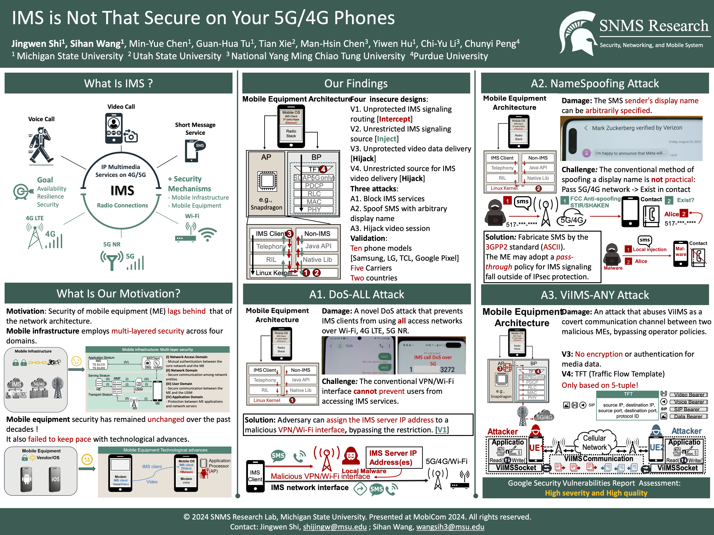

# IMS-Security-On-Mobile-Equipment

# 1. Introduction

IMS (IP Multimedia Subsystem) is vital for delivering IP-based multimedia services in mobile networks. Despite constant upgrades by 3GPP over the past two decades to support heterogeneous radio access networks (e.g., 4G LTE, 5G NR, and Wi-Fi) and enhance IMS security, the focus has primarily been on cellular infrastructure. **Consequently, IMS security measures on mobile equipment (ME), such as smartphones, lag behind rapid technological advancements.** Our study reveals that mandated IMS security measures on ME fail to keep pace, resulting in new vulnerabilities and attack vectors, including denial of service (DoS) across all networks, named SMS source spoofing, and covert communications over Video-over-IMS attacks. All vulnerabilities and proof-of-concept attacks have been experimentally validated in operational 5G/4G networks across various phone models and network operators. Finally, we propose and prototype standard-compliant remedies for these vulnerabilities. 

[Mobicom 2024 Slides](https://github.com/user-attachments/files/18569379/Mobicom-Slide.pdf)

# 2. Attack Demo

1. DoS-ALL Attack

[](https://youtu.be/gHYOnps2qCI)

2. NameSpoofing Attack
[](https://youtu.be/jpsnLKp0S5Q)

3. ViIMS-ANY Attack
[](https://youtu.be/oYYxHHrFMqE)

# 3. Attack Description

[](https://github.com/user-attachments/files/18775392/Mobicom-Poster-2.pdf)

# 4. News

🎉 Our vulnerability report to Google Bug Bounty Program has received the High-Quality assessment !

🎉 Our work has been invited to the ACM GetMobile Research Highlights!

# 5. Citation

```bibtex
@inproceedings{shi2024ims,
title={IMS is Not That Secure on Your 5G/4G Phones},
author={Shi, Jingwen and Wang, Sihan and Chen, Min-Yue and Tu, Guan-Hua and Xie, Tian and Chen, Man-Hsin and Hu, Yiwen and Li, Chi-Yu and Peng, Chunyi},
booktitle={Proceedings of the 30th Annual International Conference on Mobile Computing and Networking},
pages={513--527},
year={2024}
}		
```

# 6. Acknowledgement

We would like to thank `Jacob Woodworth` for assisting with preparing the Google bug bounty report and building this website. Our gratitude also goes to `Shaan Shekhar` for collecting IMS IP data from Purdue and `Chia-Ming Tung` for validating the DoS attack over Wi-Fi from Taiwan. Your contributions were invaluable to this work.

